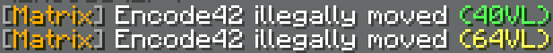
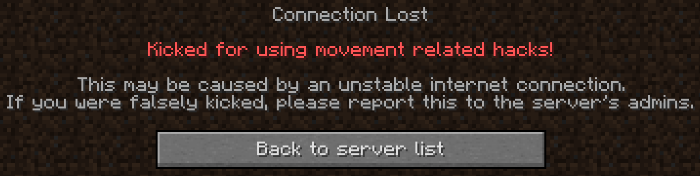
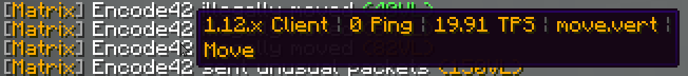

[matrix-page]: https://matrix.rip
[matrix-discord]: https://discord.matrix.rip
[matrix-issues]: https://github.com/jiangdashao/Matrix-Issues
[suite-discord]: https://discord.encode42.dev/quantumsuite

# MatrixChecks
### The highly customizable, organized, and optimized checks configuration for [Matrix Anticheat][matrix-page], a powerful, modern, and lightweight anticheat for Minecraft 1.8 and higher.
[][matrix-page] [][suite-discord] [][matrix-discord]

- **Works on free & premium Matrix!**
- Improved violation & kick messages.
- Lower amount of false positives.
- Stricter checks. *(Faster detection)*
- Multiple file types to suit your needs!
- Tons of customization options.

⚠ **REQUIRED INSTALLATION NOTE:**  
You **must** install [`language.yml`](https://raw.githubusercontent.com/QuantumSuite/MatrixChecks/main/language.yml) to use this configuration!  
Otherwise, all messages will be unreadable and commands will not work!  
Every message contains placeholders that require the language file.

## 📷 Previews
### Improved messages
Every single message has been modified to be easily read and understood.  
Messages have also been greatly reduced in length to reduce notification spam.  
Notifications, kick messages, comments, everywhere with text has been modified!  
  

### Hover messages and click commands
You can hover over notification messages to see more details!  
This includes client version, ping, server TPS, and the root check/component.  
When you click on notifications, you'll instantly spectate the suspected hacker!  
And of course, the commands and visuals are customizable in `language.yml`.  

### Customization
Every aspect of the configuration is easily customizable via `language.yml`!  
Commands, notification format, kick message, anything you'd ever need to change.  
Changes you make will take effect everywhere the variable is used.  

## 🔧 Setup
### Server Usage
1. Download [checks.yml](https://raw.githubusercontent.com/QuantumSuite/MatrixChecks/main/checks.yml) and [language.yml](https://raw.githubusercontent.com/QuantumSuite/MatrixChecks/main/language.yml).
2. Rename Matrix's original `checks.yml` and `language.yml` to something else.
3. Upload/move the new files to your Matrix plugin folder. (`/plugins/Matrix/`)
4. If you downloaded any optional files, rename them to `checks.yml`/`language.yml`.
5. Run `/matrix reload` or restart the server!

<!--
Alternatively, you can just run `/matrix dlcfg OBCHXARALB` in-game  
to download the latest stable build of MatrixChecks. (This ID changes!)  
The downside is that all comments are removed and the file size is reduced.
-->

### Cloud Usage

1. Download [config.yml](https://raw.githubusercontent.com/QuantumSuite/MatrixChecks/main/config.yml) and [language.yml](https://raw.githubusercontent.com/QuantumSuite/MatrixChecks/main/language.yml).  
2. Rename Matrix's original `config.yml` and `language.yml` to something else.
3. Change `cloud_config.enable: false` to `true` in `config.yml`.
4. Run `/matrix reload` or restart the server! The checks will now update on every reboot/reload.

## ❔ FAQ
These checks may not work perfectly with your server.  
Plugins, software, and performance can all affect how well these checks and the anticheat, in general, will work.  
**This is not a drag-and-drop solution!** Some values may need to be changed to work best with your setup.

Matrix Anticheat, like most, isn't a perfect anticheat. It itself has bugs that we cannot fix.  
These checks aim to mitigate those issues and improve what works well, but there's only so much we can do.  
Tested and configured for survival and minigame servers. Tweak the checks for your own server!

What is the X folder/file?

#### Variations
These are modifications of the original checks configuration files (`checks.yml`, `language.yml`, `config.yml`) with pre-configured changes. These changes range from kick obscurity to new detection algorithms.

They're located in the [variations](https://github.com/QuantumSuite/MatrixChecks/tree/main/variations) folder of the repository. Each variation has its own readme file that describes the variation that shows up when you enter the variation's folder. Just click around to figure out what's offered!

#### Cloud Files
A directory that contains all of the configuration files, including variations, but minified. These are much smaller in file size but are impossible to read and modify.

Because of the small file sizes, these can be automatically downloaded and updated very quickly on server startup. These are optimized for Matrix cloud usage with `config.yml`. For instructions, read [Cloud Usage](https://github.com/QuantumSuite/MatrixChecks#cloud-usage)!

#### Repository files
These are files that are only utilized by GitHub meant for repository information and the scripting system.

Namely:
- `.github/`
- `overrides/`
- `readme.md`
- `license.md`

Contains various scripts used for repository automation that make everything easier. You can completely ignore these files as they have nothing of importance for the end-user.

Suggested (optional) changes

These are just suggestions, don't change them if you don't need to.  
Only use these if you're having issues with the listed checks!

Root Check | Path                             | Default | Suggestion      | Reason
---------- | -------------------------------- | ------- | --------------- | -----------------------------------------------------------------------------------------------------
`click`    | `max_cps`                        | `18`    | `16` - `24`     | The highest possible CPS achieved by humans is 24. Lag may affect the accuracy of this value.
`hitbox`   | `max_reach`                      | `3.18`  | `3.2` - `3.3`   | Increase if there are many false-positives with this check. This value should never be less than 3.1!
`block`    | `fastplace.max_place_per_second` | `13`    | `10` - `18`     | Increase if there are many false-positives when placing blocks, decrease if there are many bypasses.
`scaffold` | `...delay.min_delay`             | `8`     | `5` - `9`       | Decrease if there are many false-positives when pillaring, increase if there are many bypasses.
`delay`    | `check_inventory_action`         | `4`     | `-1`            | Disable this check if players receive many false-positives when shift-clicking in inventories.
&nbsp;     | `...` = relative path            | &nbsp;  | `X - X` = range | &nbsp;

How do I report a bypass or false positive?

**First:**  
Make sure this isn't an issue with Matrix itself. Test with the [default Matrix config files](https://github.com/jiangdashao/Matrix-Issues/blob/master/checks.yml). If the issue persists, it's most likely an issue with Matrix. You can report the issue to us, but not everything can be fixed with a checks file tweak. Head over to [Matrix's support Discord][matrix-discord] and ask about the issue, or report the issue at their [issue tracker][matrix-issues].  
- [(Matrix) Discord][matrix-discord]  
- [(Matrix) Issues][matrix-issues]

**Then:**  
Report the issue in the [MatrixChecks support Discord][suite-discord] or make a report at the [issue page](https://github.com/QuantumSuite/MatrixChecks/issues) with the right template. If you describe what you want to be changed/fixed thoroughly, the chances are that it'll be taken care of quickly. If you already know what the issue is or how to fix it, feel free to make a [pull request](https://github.com/QuantumSuite/MatrixChecks/pulls) containing the change and why you made it.  
- [Discord][suite-discord]
- [Issues](https://github.com/QuantumSuite/MatrixChecks/issues)  
- [Pull Requests](https://github.com/QuantumSuite/MatrixChecks/pulls)

There are weird symbols in every message!

Do the "weird things" look like something along the lines of "`%gp_o_pr%`"? If so, you have not installed `language.yml`.  
This file is required to replace those placeholders with what they're meant to be. [Installation](https://github.com/QuantumSuite/MatrixChecks#server-usage)

Can I modify the files in MatrixChecks?

Yes! I encourage you to do so. Since all servers are different, you most likely will have to modify the files anyway.  
You can also distribute it all you want or use it on a large network; just don't remove copyright notices as that's against the license.

How can I contribute?

Contributions are very welcome! If you created a new optional file or made tweaks for different minigames, feel free to contact me or make a pull request.  
I don't want to start any competition with this project! Having everything in one central repository makes it much easier for the end-user to find what they want.

